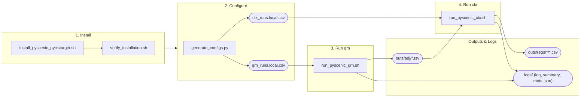

# scenic-pipeline-toolkit

[](LICENSE)
[](#)
[](#)

`scenic-pipeline-toolkit` automates running
[pySCENIC](https://github.com/aertslab/pySCENIC) (`grn` + `ctx`) and
[pycistarget](https://github.com/aertslab/pycistarget) on Ubuntu. It
replaces hand-edited bash commands with a CSV-driven pipeline: point it at
your data and it installs the environments, discovers your files, and runs
each step with validation, live progress, and a final summary. Built to be
dataset-agnostic — the same commands work for any cell line or experiment,
only the generated config changes.

> [!TIP]
> **New here?** See the [User Guide](USER_GUIDE.md) for a step-by-step
> walkthrough from a clean machine to your first run. This README is a
> quick reference once you're set up.

## How it works



Numbers 1-4 match the sections below; the unnumbered "Outputs & Logs" box
summarizes the [Telemetry](#telemetry) section. `generate_configs.py` can
fan step 3 out into several independent replicates (see
[section 2](#2-configuring-a-run)), each still crossed with every TF in
step 4. `--dry-run`/`--force`/`--quiet` (steps 3-4) and
`--replicates`/`--no-seed` (step 2) aren't shown here to keep the diagram
readable — see their sections below.

## Requirements

- Ubuntu (or another Debian-based Linux); tested on WSL2 and bare servers.
- `sudo` access, for the one-time system dependency install.
- Your own expression matrix (`.loom`), TF list, and cisTarget
  `.feather`/`.tbl` files for `ctx` (see [section 7](#7-smoke-test-with-real-aertslab-files-optional)
  for a way to fetch small official reference files to try things out
  without your own data yet).

## 1. Installation

```bash
bash scripts/install/install_pyscenic_pycistarget.sh
bash scripts/install/verify_installation.sh
```

Installs Conda/Mamba (if missing) and two separate conda environments —
`scenic` (`pyscenic`) and `pycistarget` — kept apart because the two
packages need incompatible versions of `pandas`/`numpy`/`dask`. 

Both scripts are safe to re-run; `verify_installation.sh` should end with `Summary: ALL OK.`, and tells you exactly what to fix if not.

```bash
conda activate scenic       # to run grn/ctx (below)
conda activate pycistarget  # to work with pycistarget directly
```

## 2. Configuring a run

`scripts/generate_configs.py` discovers your data and writes the CSVs —
don't hand-edit them.

```bash
python scripts/generate_configs.py   # interactive prompts
python scripts/generate_configs.py --data-dir my_data --project my_project --cell-line HepG2 --run-id my_experiment --replicates 30   # scripted
```

| Finds in data folder            | Used for                        |
|----------------------------------|----------------------------------|
| one `.loom`                      | expression matrix                |
| one `*tfs*.txt`                  | candidate regulators (`grn`)     |
| `.feather`+`.tbl` pairs per TF   | one `ctx` run per TF              |
| one extra generic pair (optional)| baseline `ctx` run (`--no-baseline` to skip) |

Each run adds a new, timestamped **file pair** to a stable folder —
nothing is ever overwritten, so it builds up a full audit trail:

```
configs/<project>/[<cell-line>/]grn_runs_<timestamp>.local.csv
configs/<project>/[<cell-line>/]ctx_runs_<timestamp>.local.csv
```

`--project` groups related runs together (e.g. all canonical-TF work);
`--cell-line` is optional, one more level of grouping (e.g. `HepG2`,
`K562`). This whole tree is gitignored (`configs/**/*.local.csv`) —
`configs/examples/*.example.csv` are the only tracked,
safe templates.

`--replicates N` runs `grn` independently N times, each crossed with every
TF for `ctx` — meant for a real server, not a laptop (see [Notes](#notes)).
Each replicate gets `seed=<N>` for reproducibility (`--no-seed` to disable).

Other flags (`--nes-threshold`, `--mode`, `--outs-dir`, `--loom`/`--tfs`,
`--baseline-feather`/`--baseline-tbl`, ...) — see `--help`.

## 3. Running `pyscenic grn`

```bash
bash scripts/run_pyscenic_grn.sh [config.csv]
```

Streams `pyscenic`'s output live (also saved in full to
`logs/grn_<run_id>.log`), then prints a summary table saved to
`logs/grn_summary_<date>.csv` — one row per run, with status, edge count,
elapsed time, output size, and the parameters used (see [Telemetry](#telemetry) below).

## 4. Running `pyscenic ctx`

```bash
bash scripts/run_pyscenic_ctx.sh [config.csv]
```

Same behavior as `grn`. With `--mode dask_multiprocessing` (the generator's
default) you'll also see `pyscenic`'s live `[####] | 42% Completed` progress
bar, plus a `[i/N]` counter across rows in the CSV.

## Telemetry

Every run of `grn`/`ctx` writes two things beyond the log: a row in the
summary CSV (`elapsed_seconds`, `output_size_bytes`, the parameters used,
`started_at`/`finished_at`) and a `logs/<grn|ctx>_<run_id>.meta.json`
sidecar with the same information plus the exact command, hostname, and
edge/regulon count — handy for aggregating stats across many replicates
without re-parsing logs:

```json
{"run_id": "my_experiment", "status": "OK", "command": "pyscenic grn ...",
 "n_edges": 2495, "output_size_bytes": 79667, "elapsed_seconds": 12,
 "started_at": "2026-01-01T10:00:00-03:00", "finished_at": "2026-01-01T10:00:12-03:00",
 "hostname": "my-server", "log_file": "logs/grn_my_experiment.log", "...": "..."}
```

## 5. Flags

Both scripts accept:

| Flag         | Effect                                                              |
|--------------|----------------------------------------------------------------------|
| `--dry-run`  | Validate paths and print the command, without calling `pyscenic`.    |
| `--force`    | Reprocess a row even if its `output_path` already exists.            |
| `--quiet`    | Disable live streaming; write only to the log file (nohup/cron).     |

By default, a row is **skipped** if `output_path` already exists and isn't
empty.

## 6. What to do when a run fails

| Status        | Meaning                                                              |
|---------------|-----------------------------------------------------------------------|
| `OK`          | Ran and the output passed validation.                                |
| `SKIPPED`     | Output already existed, wasn't redone.                                |
| `FAIL_INPUT`  | An input file in the CSV doesn't exist or is empty.                  |
| `FAIL_RUN`    | `pyscenic` exited with an error — see the log in `logs/`.             |
| `FAIL_OUTPUT` | It ran, but the output was empty or missing expected columns.        |

For any `FAIL_*`, check `logs/grn_<run_id>.log` or `logs/ctx_<run_id>.log`
for the full `pyscenic` stdout/stderr.

## 7. Smoke test with real AERTSLAB files (optional)

Validates the full grn+ctx pipeline using the official cisTarget databases
([resources.aertslab.org](https://resources.aertslab.org/)) and a synthetic
dataset built from real genes/TFs — useful before you have your own data.

```bash
conda activate scenic
bash scripts/tests/setup_real_smoke_test.sh
bash scripts/run_pyscenic_grn.sh configs/examples/grn_smoke_test.csv
bash scripts/run_pyscenic_ctx.sh configs/examples/ctx_smoke_test.csv
```

Downloads ~390MB on first run. The expression is random noise, so this
confirms the *pipeline runs* correctly with real files — not that the
regulons found are biologically meaningful.

## Dask dashboard

Both `grn` and `ctx` run on [Dask](https://www.dask.org/), which starts its
own web dashboard for the duration of the run. Open **http://localhost:8787**
in a browser while a run is in progress to see live task completion,
per-worker CPU/memory, and a task graph (if that port is taken, the
terminal output prints the port it fell back to). Optional — it closes
automatically when the run finishes.

## Project structure

```
scripts/install/       installation scripts (pyscenic + pycistarget)
scripts/                generic grn/ctx scripts + generate_configs.py + lib/common.sh
scripts/tests/          smoke-test-only scripts (not part of a real run)
configs/                per-run configuration CSVs (see section 2)
references/             original single-purpose bash scripts this toolkit
                        generalizes — not meant to be run, kept for context
data/, downloads/       input data (not versioned, see .gitignore)
outs/, logs/            run outputs and logs (not versioned)
```

## Notes

- `pyscenic grn` is memory-hungry: it fits a model per target gene using
  every candidate TF as a predictor, and each Dask worker needs RAM for its
  share of that. With a real TF list (thousands of candidates), this can
  exceed a laptop/WSL setup's available RAM per core, causing workers to be
  OOM-killed and restarted in a loop that never finishes. Run real
  (especially multi-replicate) experiments on a machine sized for the job.
- `pyscenic` and `pycistarget` have incompatible transitive dependencies
  (see [section 1](#1-installation)). Never `pip install pycistarget`
  inside the `scenic` environment; if that happens, recreate it:
  `conda env remove -n scenic -y` then rerun the installer.
- `pyscenic 0.12.1` (2022) uses `np.object`/`np.bool`/`np.int`, removed by
  NumPy 1.24 — the installer pins `numpy==1.23.5` + `numba==0.56.4` +
  `llvmlite==0.39.1`. Don't upgrade numpy in that environment.
- `pyscenic grn` (via `arboreto`) breaks on Dask's `dask-expr` backend
  (default since 2024.03.0) — the installer pins `dask==2023.5.0` +
  `distributed==2023.5.0`. Don't upgrade dask in that environment either.

## Contributing

Issues and pull requests are welcome — open one to discuss a change or
propose a fix.

## Authors

<div align="center">
  <table>
    <tr>
      <td align="center">
        <a href="https://github.com/pleonlopes">
          <br />
          <sub><b>Pedro Lopes</b></sub>
        </a>
      </td>
      <td align="center">
        <a href="https://github.com/irlvinicius">
          <br />
          <sub><b>Vinícius Vieira</b></sub>
        </a>
      </td>
      <td align="center">
        <a href="https://github.com/JVictorFFernandes">
          <br />
          <sub><b>Victor Fernandes</b></sub>
        </a>
      </td>
    </tr>
  </table>
</div>

## License

[MIT](LICENSE)