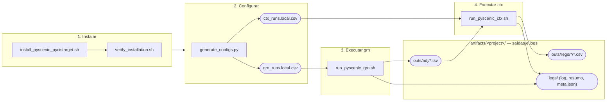

# scenic-pipeline-toolkit

[](LICENSE)
[](#)
[](#)

O `scenic-pipeline-toolkit` automatiza a execução do
[pySCENIC](https://github.com/aertslab/pySCENIC) (`grn` + `ctx`) e do
[pycistarget](https://github.com/aertslab/pycistarget) no Ubuntu. Ele
substitui comandos bash editados manualmente por um pipeline orientado a CSV:
aponte para os seus dados e ele instalará os ambientes, detectará seus
arquivos e executará cada etapa com validação, progresso em tempo real e um
resumo final. Desenvolvido para ser agnóstico a conjuntos de dados — os mesmos
comandos funcionam para qualquer linhagem celular ou experimento, alterando
apenas a configuração gerada.

> [!TIP]
> **Novo por aqui?** Consulte o [Guia do Usuário](USER_GUIDE.md) para um
> passo a passo detalhado, desde uma máquina limpa até sua primeira execução.
> Este README serve como uma referência rápida após a configuração inicial.

## Como funciona



Os números 1 a 4 correspondem às seções abaixo; o bloco não numerado "Saídas e Logs"
resume a seção de [Telemetria](#telemetria). O script `generate_configs.py` pode
desdobrar a etapa 3 em várias réplicas independentes (consulte a
[seção 2](#2-configurando-uma-execução)), cada uma combinada com todos os FTs na
etapa 4. As opções `--dry-run`/`--force`/`--quiet` (etapas 3-4) e
`--replicates`/`--no-seed` (etapa 2) foram omitidas aqui para manter o diagrama
legível — consulte as respectivas seções abaixo.

## Requisitos

- Ubuntu (ou outra distribuição Linux baseada em Debian); testado no WSL2 e em servidores dedicados (*bare-metal*).
- Acesso `sudo`, para a instalação única das dependências do sistema.
- Sua própria matriz de expressão (`.loom`), lista de fatores de transcrição (FTs) e arquivos
  `.feather`/`.tbl` do cisTarget para o `ctx` (consulte a [seção 7](#7-smoke-test-com-arquivos-reais-do-aertslab-opcional)
  para baixar pequenos arquivos de referência oficiais e testar o fluxo
  antes de usar seus próprios dados).

## 1. Instalação

```bash
bash scripts/install/install_pyscenic_pycistarget.sh
bash scripts/install/verify_installation.sh
```

Instala o Conda/Mamba (caso não esteja instalado) e dois ambientes conda separados —
`scenic` (`pyscenic`) e `pycistarget` — mantidos isolados pois os dois
pacotes exigem versões incompatíveis de `pandas`/`numpy`/`dask`.

Ambos os scripts podem ser reexecutados com segurança; o `verify_installation.sh`
deve terminar com `Summary: ALL OK.` e indicará exatamente o que corrigir caso contrário.

```bash
conda activate scenic       # para executar grn/ctx (abaixo)
conda activate pycistarget  # para trabalhar diretamente com o pycistarget
```

## 2. Configurando uma execução

O script `scripts/generate_configs.py` localiza seus dados e gera os CSVs —
não os edite manualmente.

```bash
python scripts/generate_configs.py   # prompts interativos
python scripts/generate_configs.py --data-dir my_data --project my_project --cell-line HepG2 --run-id my_experiment --replicates 30   # automatizado
```

| Localizado na pasta de dados     | Usado para                       |
|----------------------------------|----------------------------------|
| um arquivo `.loom`               | matriz de expressão              |
| um arquivo `*tfs*.txt`           | reguladores candidatos (`grn`)   |
| pares `.feather`+`.tbl` por FT   | uma execução de `ctx` por FT     |
| um par genérico extra (opcional) | execução de controle (*baseline*) do `ctx` (`--no-baseline` para ignorar) |

Cada execução adiciona um novo **par de arquivos** com carimbo de data/hora (*timestamp*)
a uma pasta `configs/` estável — nada é sobrescrito, garantindo uma trilha de
auditoria completa. Os diretórios `logs/` e `outs/` ficam no mesmo nível da pasta
`configs/`, de modo que tudo relacionado a um projeto/linhagem celular fique
reunido sob um único diretório `artifacts/<project>/`:

```
artifacts/<project>/[<cell-line>/]configs/grn_runs_<timestamp>.local.csv
artifacts/<project>/[<cell-line>/]configs/ctx_runs_<timestamp>.local.csv
artifacts/<project>/[<cell-line>/]logs/...          (gerado ao executar grn/ctx)
artifacts/<project>/[<cell-line>/]outs/adj/...      (gerado pelo grn)
artifacts/<project>/[<cell-line>/]outs/regs/...     (gerado pelo ctx)
```

`--project` agrupa execuções relacionadas (ex.: todos os experimentos com FTs canônicos);
`--cell-line` é opcional, oferecendo mais um nível de agrupamento (ex.: `HepG2`,
`K562`) — ambos não diferenciam maiúsculas de minúsculas (`HepG2`/`hepg2`/`HEPG2`
apontam para a mesma pasta). Toda essa árvore é ignorada pelo Git (`artifacts/`) —
ela armazena caminhos reais específicos da máquina e saídas das execuções. A pasta
`artifacts/examples/*.example.csv` é um conjunto separado e rastreado de modelos para
o *smoke test*, sem relação com este diretório `artifacts/.../configs/` específico por projeto.

Os resultados (`--outs-dir`, por padrão o diretório irmão `outs/` descrito acima)
e os logs desta execução (gravados por `grn`/`ctx` na pasta irmã `logs/`)
seguem esta estrutura — consulte [Telemetria](#telemetria).

`--replicates N` executa o `grn` de forma independente N vezes, combinando cada réplica
com todos os FTs no `ctx` — projetado para um servidor dedicado, não para um laptop
(consulte [Notas](#notas)). Cada réplica recebe `seed=<N>` para reprodutibilidade
(`--no-seed` para desativar).

Para outros parâmetros (`--nes-threshold`, `--mode`, `--outs-dir`, `--loom`/`--tfs`,
`--baseline-feather`/`--baseline-tbl`, ...) — consulte `--help`.

## 3. Executando o `pyscenic grn`

```bash
bash scripts/run_pyscenic_grn.sh [config.csv]
```

Transmite a saída do `pyscenic` em tempo real (também salva integralmente em um
arquivo `.log` ao lado do CSV de configuração — consulte [Telemetria](#telemetria))
e, em seguida, exibe uma tabela de resumo com status, contagem de conexões (*edges*),
tempo decorrido, tamanho da saída e os parâmetros utilizados.

## 4. Executando o `pyscenic ctx`

```bash
bash scripts/run_pyscenic_ctx.sh [config.csv]
```

Mesmo comportamento do `grn`. Com `--mode dask_multiprocessing` (padrão do gerador),
você também verá a barra de progresso em tempo real do `pyscenic`
`[####] | 42% Completed`, além de um contador `[i/N]` entre as linhas do CSV.

## Telemetria

O `grn`/`ctx` gravam seus logs em um diretório `logs/` que fica no **mesmo nível
da pasta `configs/` onde está o CSV executado** — ex.:
`artifacts/<project>/[<cell-line>/]logs/` — em vez de uma pasta global única, mantendo
juntos as configurações, os resultados e todo o histórico de execução de um projeto:

```
artifacts/<project>/[<cell-line>/]logs/<grn|ctx>_<run_id>.log
artifacts/<project>/[<cell-line>/]logs/<grn|ctx>_summary_<date>.csv
artifacts/<project>/[<cell-line>/]logs/<grn|ctx>_<run_id>.meta.json
```

O CSV de resumo contém uma linha por execução (`elapsed_seconds`, `output_size_bytes`,
parâmetros utilizados, `started_at`/`finished_at`); o arquivo complementar (*sidecar*)
`.meta.json` traz as mesmas informações acrescidas do comando exato, nome do host
(*hostname*) e contagem de arestas/regulons — ideal para consolidar estatísticas
entre múltiplas réplicas sem precisar reprocessar os logs:

```json
{"run_id": "my_experiment", "status": "OK", "command": "pyscenic grn ...",
 "n_edges": 2495, "output_size_bytes": 79667, "elapsed_seconds": 12,
 "started_at": "2026-01-01T10:00:00-03:00", "finished_at": "2026-01-01T10:00:12-03:00",
 "hostname": "my-server", "log_file": "artifacts/my_project/logs/grn_my_experiment.log", "...": "..."}
```

Os resultados seguem o mesmo layout de projeto/linhagem celular por padrão:
`artifacts/<project>/[<cell-line>/]outs/adj/...` e `.../outs/regs/...` —
consulte a [seção 2](#2-configurando-uma-execução).

## 5. Flags

Ambos os scripts aceitam:

| Flag         | Efeito                                                               |
|--------------|----------------------------------------------------------------------|
| `--dry-run`  | Valida os caminhos e exibe o comando, sem executar o `pyscenic`.     |
| `--force`    | Reprocessa uma linha mesmo se o seu `output_path` já existir.        |
| `--quiet`    | Desativa o streaming ao vivo; grava apenas no arquivo de log (nohup/cron). |

Por padrão, uma linha é **ignorada** (*skipped*) se o `output_path` já existir e não estiver vazio.

## 6. O que fazer quando uma execução falha

| Status        | Significado                                                           |
|---------------|-----------------------------------------------------------------------|
| `OK`          | Executou e a saída passou na validação.                               |
| `SKIPPED`     | A saída já existia e não foi reexecutada.                             |
| `FAIL_INPUT`  | Um arquivo de entrada no CSV não existe ou está vazio.                |
| `FAIL_RUN`    | O `pyscenic` encerrou com erro — veja o log ao lado da configuração.  |
| `FAIL_OUTPUT` | Executou, mas a saída estava vazia ou sem as colunas esperadas.       |

Para qualquer erro `FAIL_*`, verifique o arquivo `<grn|ctx>_<run_id>.log` na pasta `logs/`
ao lado do CSV de configuração executado (consulte [Telemetria](#telemetria)) para
acessar a saída completa (`stdout`/`stderr`) do `pyscenic`.

## 7. Smoke test com arquivos reais do AERTSLAB (opcional)

Valida o pipeline completo de `grn` + `ctx` usando os bancos de dados oficiais do cisTarget
([resources.aertslab.org](https://resources.aertslab.org/)) e um conjunto de dados sintético
construído a partir de genes e fatores de transcrição reais — útil para verificar o ambiente
antes de usar seus próprios dados.

```bash
conda activate scenic
bash scripts/tests/setup_real_smoke_test.sh
bash scripts/run_pyscenic_grn.sh artifacts/examples/grn_smoke_test.csv
bash scripts/run_pyscenic_ctx.sh artifacts/examples/ctx_smoke_test.csv
```

Baixa cerca de 390 MB na primeira execução. Como os dados de expressão são ruído aleatório,
o teste confirma apenas que o *pipeline executa* corretamente com arquivos reais — e não
que os regulons identificados tenham relevância biológica.

## Painel do Dask (Dashboard)

Tanto o `grn` quanto o `ctx` utilizam o [Dask](https://www.dask.org/), que inicializa
seu próprio painel web durante a execução. Acesse **http://localhost:8787**
em um navegador enquanto uma execução estiver em andamento para acompanhar em tempo real
a conclusão das tarefas, o uso de CPU/memória por worker e o grafo de execução
(se a porta estiver ocupada, a saída no terminal informará a porta alternativa utilizada).
Essa etapa é opcional — o painel fecha automaticamente ao término da execução.

## Estrutura do projeto

```
scripts/install/                      scripts de instalação (pyscenic + pycistarget)
scripts/                              scripts genéricos de grn/ctx + generate_configs.py + lib/common.sh
scripts/tests/                        scripts exclusivos para smoke test (não fazem parte de execuções reais)
artifacts/examples/                   CSVs de exemplo/smoke test rastreados (consulte a seção 7) — exceção no .gitignore
artifacts/<project>/[<cell-line>/]    configs/, logs/ e outs/ de execuções reais, agrupados (não versionados)
references/                           scripts bash monouso originais que este toolkit
                                      generaliza — mantidos apenas para histórico e contexto, não devem ser executados
data/, downloads/                     dados de entrada (não versionados, consulte o .gitignore)
```

## Notas

- O `pyscenic grn` consome muita memória: ele ajusta um modelo por gene-alvo usando cada
  FT candidato como preditor, e cada worker do Dask precisa de RAM suficiente para sua
  fatia desse processamento. Com uma lista real de FTs (milhares de candidatos), isso pode
  exceder a RAM disponível por núcleo em laptops ou no WSL, fazendo com que os workers sejam
  interrompidos pelo sistema operacional por falta de memória (*OOM-killed*) e reiniciados
  em um ciclo interminável. Execute experimentos reais (especialmente com múltiplas
  réplicas) em uma máquina adequadamente dimensionada.
- O `pyscenic` e o `pycistarget` possuem dependências transitivas incompatíveis
  (consulte a [seção 1](#1-instalação)). Nunca execute `pip install pycistarget`
  dentro do ambiente `scenic`; se isso acontecer, recrie-o:
  `conda env remove -n scenic -y` e execute o script de instalação novamente.
- O `pyscenic 0.12.1` (2022) utiliza `np.object`/`np.bool`/`np.int`, tipos removidos
  a partir do NumPy 1.24 — o instalador fixa `numpy==1.23.5` + `numba==0.56.4` +
  `llvmlite==0.39.1`. Não atualize o NumPy nesse ambiente.
- O `pyscenic grn` (via `arboreto`) falha com o backend `dask-expr` do Dask
  (padrão desde a versão 2024.03.0) — o instalador fixa `dask==2023.5.0` +
  `distributed==2023.5.0`. Também não atualize o Dask nesse ambiente.

## Contribuindo

Contribuições via *issues* e *pull requests* são bem-vindas — abra um apontamento para
discutir alterações ou propor correções.

## Autores

<div align="center">
  <table>
    <tr>
      <td align="center">
        <a href="https://github.com/pleonlopes">
          <br />
          <sub><b>Pedro Lopes</b></sub>
        </a>
      </td>
      <td align="center">
        <a href="https://github.com/irlvinicius">
          <br />
          <sub><b>Vinícius Vieira</b></sub>
        </a>
      </td>
      <td align="center">
        <a href="https://github.com/JVictorFFernandes">
          <br />
          <sub><b>Victor Fernandes</b></sub>
        </a>
      </td>
    </tr>
  </table>
</div>

## Licença

[MIT](LICENSE)